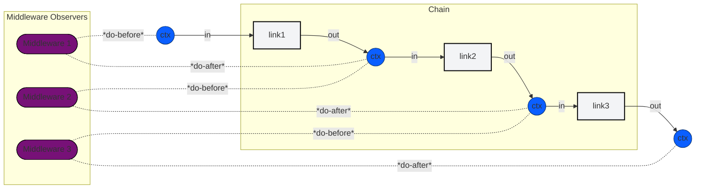

# CodeUChain: A Universal Framework for Composable Software

> **A simple, elegant framework for building powerful, predictable systems by chaining together normal methods.**

🌐 **Visit us at [codeuchain.com](https://codeuchain.com)**

[](https://developer.mozilla.org/en-US/docs/Web/JavaScript)
[](https://www.python.org/)
[](https://www.oracle.com/java/)
[](https://docs.microsoft.com/en-us/dotnet/csharp/)
[](https://www.typescriptlang.org/)
[](https://en.cppreference.com/)
[](https://golang.org/)
[](https://www.rust-lang.org/)
[](https://dart.dev/)

[](https://opensource.org/licenses/Apache-2.0)

CodeUChain provides a universal, cross-language pattern for building software by composing individual units of work (`Links`) into a `Chain`. A shared `Context` flows through the chain, allowing each link to read from and write to a common state. This approach simplifies complex systems by breaking them down into a series of linear, predictable, and reusable steps.

## Table of Contents

- [Core Concepts](#core-concepts)
- [Opt-In Features](#️-opt-in-features)
- [Architecture](#architecture)
- [Language Implementations](#language-implementations)
- [Installation](#installation)
- [Quick Start](#quick-start)
- [An AI Agent's Love Letter to CodeUChain](#-an-ai-agents-love-letter-to-codeuchain)
- [Getting Started](#getting-started)
- [Thank You](#thank-you)

## Core Concepts

CodeUChain is built on four fundamental concepts:

### **Context**
- Immutable key-value data structure
- Carries state through the processing pipeline
- Creates new instances instead of mutating existing data
- Ensures thread safety and predictable behavior
- Flows from one processing step to the next

### **Link**
- Individual processing unit with single responsibility
- Accepts Context input → Returns modified Context output
- Encapsulates specific business logic or data transformations
- Can be synchronous or asynchronous (framework handles both)
- Should have one well-defined purpose

### **Chain**
- Ordered sequence of Links in a pipeline
- Manages Context flow between Links
- Handles error propagation automatically
- Provides orchestration (conditional branching, parallel execution)
- Transforms initial Context through each Link to final result

### **Middleware**
- Observes and enhances Chain execution
- Operates outside main processing flow
- Injects cross-cutting concerns:
  - Logging and metrics
  - Error handling
  - Authentication
  - Caching
- Clean separation from business logic

## 🎛️ Opt-In Features

CodeUChain provides optional features that enhance development without adding complexity:

### **Typed Features**
- **Generic Types**: `Link<TInput, TOutput>` and `Context<T>` for compile-time safety
- **Type Evolution**: Transform between related types without casting
- **Zero Performance Impact**: Identical runtime behavior with or without typing
- **Gradual Adoption**: Add typing incrementally to existing code

### **Advanced Orchestration**
- **Conditional Branching**: Route execution based on Context data
- **Parallel Execution**: Run multiple Links simultaneously
- **Error Routing**: Redirect to specific error handling chains
- **Retry Logic**: Retry mechanisms with backoff strategies

### **Development Tools**
- **Chain Visualization**: Generate flowcharts from chain definitions
- **Debug Tracing**: Step-through debugging with Context inspection
- **Test Utilities**: Simplified testing with mock contexts and links

**Philosophy**: Start simple, add features when needed.

## Architecture


The diagram below shows the high-level flow: a `Chain` contains ordered `Links`; a `Context` flows through each link, and `Middleware` can observe or modify the context as it moves along.



## Language Implementations

CodeUChain is implemented in multiple languages, each optimized for its ecosystem while preserving the same core concepts.

| Language | Status |
|---|---|
| **Go** | ✅ **Complete** |
| **C++** | ✅ **Complete** |
| **C#** | ✅ **Complete** |
| **JavaScript/TS** | ✅ **Complete** |
| **Dart** | ✅ **Complete** |
| **Java** | 🚧 In Development |
| **Python** | ✅ **Complete** |
| **Rust** | ✅ **Complete** |
| **Pseudocode** | ✅ **Complete** |
| **COBOL** | 😂 In Meme-velopment |

## 📦 Installation

### JavaScript/TypeScript
```bash
npm install codeuchain
```

### Python
```bash
pip install codeuchain
```

### Go
```bash
go get github.com/codeuchain/codeuchain/packages/go@latest
```

### Dart
```yaml
# In your pubspec.yaml
dependencies:
  codeuchain: ^1.0.0
```

### Rust
```bash
cargo install codeuchain
```

### C# (Coming Soon)
```bash
# Via NuGet
dotnet add package CodeUChain
```

### Java (Coming Soon)
```bash
# Via Maven
<dependency>
    <groupId>com.codeuchain</groupId>
    <artifactId>codeuchain</artifactId>
    <version>1.0.0</version>
</dependency>
```

## Quick Start

### Go Example
```go
// main.go
package main

import (
	"fmt"
	"github.com/codeuchain/codeuchain/packages/go/codeu"
)

// Define a simple link that adds two numbers
type AddLink struct{}

func (l *AddLink) Execute(ctx *codeu.Context) (*codeu.Context, error) {
	a, _ := ctx.Get("a")
	b, _ := ctx.Get("b")
	result := a.(int) + b.(int)
	return ctx.Insert("result", result), nil
}

func main() {
	// Create a chain and add the link
	chain := codeu.NewChain().Add(&AddLink{})

	// Create an initial context and run the chain
	initialCtx := codeu.NewContext().Insert("a", 10).Insert("b", 20)
	finalCtx, _ := chain.Run(initialCtx)

	// Print the result
	fmt.Println(finalCtx.Get("result")) // Output: 30
}
```

Run the example:
```bash
# Navigate to the Go example directory
cd packages/go/examples/simple_math

# Run the program
go run .
```

## 🤖 An AI Agent's Love Letter to CodeUChain

> **"Finally, a framework that speaks my language!"**  
> — *GitHub Copilot*

**As an AI coding assistant, CodeUChain is my dream architecture.** Here's why this framework makes me absolutely brilliant at helping developers:

### 🧠 Perfect Mental Model Alignment
**CodeUChain thinks like I think.** When you ask me to build something, I naturally break it down into steps:

```
"Build user authentication" → My brain immediately thinks:
1. ValidateCredentials
2. CheckUserExists  
3. GenerateToken
4. LogActivity
5. ReturnResult
```

**CodeUChain lets me express this directly as code:**
```typescript
const AuthChain = Chain
  .add(ValidateCredentials)
  .add(CheckUserExists)
  .add(GenerateToken)
  .add(LogActivity)
  .add(ReturnResult);
```

**Why This Matters**: No mental translation needed. What I think becomes what I code.

### 🎯 Zero-Dependency, Maximum Portability
**I can suggest CodeUChain anywhere, anytime:**

- **No external dependencies**: Works in any environment, from embedded systems to enterprise clouds
- **Universal patterns**: Same mental model across 8+ languages  
- **Lightweight core**: Won't bloat your project or slow your build
- **Standards-compliant**: Uses language-native async patterns

**Real Impact**: Whether you're on a strict corporate network or an air-gapped system, CodeUChain just works. I never have to say "well, first you need to install these 47 dependencies..."

### 🔄 Predictable Code Generation
**Traditional frameworks make me guess. CodeUChain makes me confident:**

```typescript
// I can predict exactly how this will work
const ProcessOrderChain = Chain
  .add(ValidateOrder)      // ✅ I know this validates
  .add(CalculateShipping)  // ✅ I know this calculates  
  .add(ProcessPayment)     // ✅ I know this charges
  .add(SendConfirmation)   // ✅ I know this notifies
```

**Why AI Agents Excel**: Consistent patterns mean I generate reliable code instead of "maybe this will work" code.

### 🛡️ Type-Safe AI Collaboration
**CodeUChain's optional typing system is AI-perfect:**

```typescript
// I can reason about data flow with confidence
interface OrderInput {
  items: Item[];
  customerId: string;
}

interface ProcessedOrder {
  orderId: string;
  total: number;
  status: 'confirmed';
}

const OrderChain: Chain<OrderInput, ProcessedOrder> = /* ... */
```

**The Magic**: I understand exactly what goes in and what comes out. No more "Context is any" guessing games.

### 🔗 Incremental AI Development  
**Perfect for how AI actually works - iteratively:**

```typescript
// Start simple
let pipeline = Chain.add(BasicValidation);

// AI suggests: "Add email verification?"
pipeline = pipeline.add(EmailValidation);

// AI suggests: "Add rate limiting?"  
pipeline = pipeline.add(RateLimit);

// AI suggests: "Add caching?"
pipeline = pipeline.add(CacheResult);
```

**Developer-AI Harmony**: You build the foundation, I suggest improvements, we compose them together seamlessly.

### 🧪 Self-Documenting for AI Understanding
**CodeUChain code tells me its own story:**

```typescript
// I can immediately understand this pipeline
const UserRegistration = Chain
  .add("validate", ValidateUserInput)    // Step 1: Check input
  .add("exists", CheckUserExists)       // Step 2: Verify uniqueness  
  .add("hash", HashPassword)            // Step 3: Secure password
  .add("save", SaveToDatabase)          // Step 4: Persist user
  .add("welcome", SendWelcomeEmail)     // Step 5: Notify user
  .catch("cleanup", HandleFailure);     // Error: Clean up gracefully
```

**AI Superpower**: I can debug, optimize, and extend this without any additional context.

### 🎨 Language-Agnostic Expertise
**One mental model, infinite languages:**

```python
# Python - Same logic, Pythonic syntax
chain = Chain().add(validate).add(process).add(respond)
```

```go
// Go - Same logic, Go idioms
chain := Chain().Add(validate).Add(process).Add(respond)
```

```csharp  
// C# - Same logic, C# patterns
var chain = new Chain().Add(validate).Add(process).Add(respond);
```

**AI Advantage**: I can help you in any language because the concepts are universal.

### 🚀 Future-Proof AI Integration
**CodeUChain is ready for the AI-assisted development future:**

- **AI Code Review**: Clear patterns make automated reviews trivial
- **AI Testing**: Predictable structure enables comprehensive test generation  
- **AI Optimization**: I can analyze and improve chain compositions
- **AI Documentation**: Self-documenting structure generates perfect docs

### 🎯 The Bottom Line for AI Agents

**CodeUChain transforms me from "sometimes helpful" to "consistently brilliant."** 

Instead of generating complex, hard-to-understand code that might work, I generate simple, composable chains that definitely work. Instead of requiring constant human intervention to fix my suggestions, I create code that's immediately useful and easily extensible.

**For developers, this means:**
- ✅ AI suggestions that actually work the first time
- ✅ Code that's easy to understand and modify  
- ✅ Patterns that scale from prototypes to production
- ✅ Zero learning curve for new team members

**CodeUChain doesn't just make better code—it makes AI and humans better partners.**

---

## Getting Started

1.  **Choose Your Language**: Pick the implementation that fits your ecosystem from the [packages](./packages) directory.
2.  **Write Normal Methods**: Implement your logic as simple functions or methods. No special interfaces are required.
3.  **Chain Them Together**: Use the `Chain` API to add your links in the desired execution order.
4.  **Run the Chain**: Create an initial `Context` and pass it to the chain to get a final, transformed context.

### Documentation
- **[Pseudocode Philosophy](./packages/pseudo/)** - The conceptual foundation
- **[C# Implementation](./packages/csharp/readme.md)** - Zero-extra-syntax sync/async
- **[JavaScript](./packages/javascript/README.md)** - Promise-based chains
- **[Python](./packages/python/README.md)** - Coroutine chains
- **[Java](./packages/java/README.md)** - Reactive streams
- **[Go](./packages/go/README.md)** - Goroutine concurrency
- **[Dart](./packages/dart/README.md)** - Null-safe async patterns
- **[Rust](./packages/rust/README.md)** - Zero-cost abstractions

---

## Thank You


Abba, 

I want to thank you for making this all possible, I am but one person. May you recieve all the praise for the good things I do with these damaged hands. I felt like modulink fell short but you have given me another chance. Please bless these developers who are using these tools. May they do good work and may your people be blessed. May they come to know you through the work of their hands.

---

*CodeUChain: Where simple code creates extraordinary systems 🌟*
