# CodeUChain: Code That You Chain

> **The simple, elegant idea that transforms how you build software.** Write normal methods, chain them together, and watch beautiful systems emerge.

[](https://developer.mozilla.org/en-US/docs/Web/JavaScript)
[](https://www.python.org/)
[](https://www.oracle.com/java/)
[](https://docs.microsoft.com/en-us/dotnet/csharp/)
[](https://www.typescriptlang.org/)
[](https://en.cppreference.com/)
[](https://golang.org/)
[](https://www.rust-lang.org/)

[](https://opensource.org/licenses/Apache-2.0)

## Architecture (Mermaid Diagram)

The diagram below shows the high-level flow: a `Chain` contains ordered `Links`; a `Context` (the force applied to the chain) flows through each link, and `Middleware` acts like dampeners placed between links to observe or modify the context as it moves along.

```mermaid
%%{init: {'themeCSS': ".node.cctx circle, .node.cctx rect {fill:#0b5fff; stroke:#08306b;} .node.cctx text {fill:#fff;} .node.cctx {transition:opacity .2s;} .node.cctx.c0 circle, .node.cctx.c0 rect{animation: appear 4.5s linear infinite 0s;} .node.cctx.c1 circle, .node.cctx.c1 rect{animation: appear 4.5s linear infinite 1.125s;} .node.cctx.c2 circle, .node.cctx.c2 rect{animation: appear 4.5s linear infinite 2.25s;} .node.cctx.c3 circle, .node.cctx.c3 rect{animation: appear 4.5s linear infinite 3.375s;} .linkNode rect, .linkNode circle {fill:#f3f4f6; stroke:#111; stroke-width:2px;} .linkNode text{fill:#111;} .node.final circle, .node.final rect {fill:#06b875; stroke:#054a36;} .node.final text{fill:#fff;} .observer rect, .observer circle{fill:#fff3cd; stroke:#8a6d1f;} .observer text{fill:#000;} .observer.obs1 rect, .observer.obs1 circle{animation: observeBlink 4.5s linear infinite 0.6s;} .observer.obs2 rect, .observer.obs2 circle{animation: observeBlink 4.5s linear infinite 2.5s;} .edgePath path{stroke-dasharray:6 6; stroke-width:2px; stroke:#9aa; animation: dash 4.5s linear infinite;} .edgePath:nth-of-type(1) path{animation-delay:0.6s;} .edgePath:nth-of-type(2) path{animation-delay:2.1s;} .edgePath:nth-of-type(3) path{animation-delay:3.6s;} @keyframes observeBlink {0%{opacity:0.5}12%{opacity:1}33%{opacity:1}45%{opacity:0.5}100%{opacity:0.5}} @keyframes dash {to{stroke-dashoffset:-72}} @keyframes appear {0%{opacity:0}12%{opacity:1}33%{opacity:1}45%{opacity:0}100%{opacity:0}} "}}%%
flowchart LR
    subgraph observers[Middleware Observers]
    direction LR
        MW1([Middleware 1])
        MW2([Middleware 2])
        MW3([Middleware 3])
    end

    classDef mw fill:#717,stroke:#000,stroke-width:1px;
    class MW1,MW2 mw;

    %% Dashed observer connections (observing from outside)
    MW1 -. *do-before* .- starting_ctx
    MW1 -. *do-after* .- ctx1
    MW2 -. *do-before* .- ctx1
    MW2 -. *do-after* .- ctx2
    MW3 -. *do-before* .- ctx2
    MW3 -. *do-after* .- ctx3

    class MW1,MW2,MW3 mw;
    class MW1 observer;
    class MW2 observer;
    class MW3 observer;
    
    %% Chain with links and animated context nodes
    subgraph Chain[Chain]
        direction LR
        L1["link1"]
        ctx1(("ctx"))
        L2["link2"]
        ctx2(("ctx"))
        L3["link3"]
    end

    starting_ctx((ctx)) -->|in| L1
    L1 -->|out| ctx1
    ctx1 -->|in| L2
    L2 -->|out| ctx2
    ctx2 -->|in| L3

    %% Final emitted context node (end of chain)
    ctx3(("ctx"))
    L3 -->|out| ctx3

    %% Assign simple class names so themeCSS can target specific nodes
    class starting_ctx cctx;
    class starting_ctx c0;
    class ctx1 cctx;
    class ctx1 c1;
    class ctx2 cctx;
    class ctx2 c2;
    class ctx3 cctx;
    class ctx3 c3;

    %% Class link nodes so themeCSS can animate them
    class L1 linkNode;
    class L1 l1;
    class L2 linkNode;
    class L2 l2;
    class L3 linkNode;
    class L3 l3;
```



Notes:
- The `Chain` is an ordered sequence of `Links`.
- `Context` is the data that flows (the "force" applied to the chain) and is passed from link to link.
- `Middleware` sits between links (like dampeners) and may inspect, transform, or short-circuit the context.
- If GitHub doesn't render the diagram in your viewer, paste the `mermaid` block into https://mermaid.live to preview.

## Table of Contents

- [The Simple Truth](#the-simple-truth-code-that-you-chain)
- [Installation](#installation)
- [Why CodeUChain Matters](#why-codeuchain-matters-the-conceptual-foundation)
  - [The Human Mind Craves Chains](#the-human-mind-craves-chains)
  - [Composition Over Complexity](#composition-over-complexity)
  - [Errors as Information](#errors-as-information)
- [Developer Experience](#the-developer-experience-why-developers-love-this)
  - [Freedom from Complexity](#freedom-from-complexity)
  - [Predictable Flow](#predictable-flow)
  - [Creative Flow State](#creative-flow-state)
- [The Innovation](#the-innovation-zero-extra-syntax-syncasync)
- [Language Implementations](#language-implementations)
- [Quick Start Examples](#quick-start-examples)
- [The Philosophy](#the-philosophy-agape-in-code)
- [Why It Works](#why-it-works-the-architectural-elegance)
- [The Future](#the-future-of-software-development)
- [Before and After: An AI's Perspective on CodeUChain](#before-and-after-an-ais-perspective-on-codeuchain)
- [Getting Started](#getting-started)

---

## The Simple Truth: Code That You Chain

**CodeUChain is literally code that you chain.** It's the elegant idea that you can write normal methods and simply chain them together to create powerful systems.

```
Normal Method → Normal Method → Normal Method = Powerful System
```

**That's it.** No complex interfaces, no special syntax, no framework gymnastics. Just write the code you want to run, chain it together, and let the magic happen.

## 📦 Installation

Choose your language and install CodeUChain:

### JavaScript/TypeScript
```bash
npm install codeuchain
```

### Python
```bash
pip install codeuchain
```

### Go
```bash
go get github.com/codeuchain/codeuchain/packages/go@latest
```

### Rust
```bash
cargo install codeuchain
```

### C# (Coming Soon)
```bash
# Via NuGet
dotnet add package CodeUChain
```

### Java (Coming Soon)
```bash
# Via Maven
<dependency>
    <groupId>com.codeuchain</groupId>
    <artifactId>codeuchain</artifactId>
    <version>1.0.0</version>
</dependency>
```

## Why CodeUChain Matters: The Conceptual Foundation

### The Human Mind Craves Chains
**Our brains naturally think in chains.** We break problems into steps, execute them in sequence, and build complex solutions from simple parts.

```
Think → Plan → Execute → Verify → Improve
```

**Traditional Code**: Forces you to think in tangled webs of dependencies
**CodeUChain**: Lets you think in beautiful, linear chains that match your natural thought process

**Why This Matters**: When your code structure matches how you think, you become exponentially more productive.

### Composition Over Complexity
**The universe builds everything through composition.** Atoms form molecules, molecules form cells, cells form organisms.

```
Simple Parts → Combine → Complex Systems
```

**CodeUChain embraces this universal principle:**
- Each link has one job
- Links combine to create infinite possibilities
- Complexity emerges from simplicity

### Errors as Information
**Traditional systems crash when things go wrong.** CodeUChain sees errors as valuable signals:

```
Error → Learn → Improve → Stronger System
```

**The Paradigm Shift**: Instead of "system failed," you get "system learned and became better."

## The Developer Experience: Why Developers Love This

### Freedom from Complexity
**Traditional frameworks bury you in interfaces and adapters.** CodeUChain sets you free:

```
Before: Implement ISyncLink<T>, IAsyncLink<T>, IChainBuilder...
After: Write normal methods, chain them together
```

**Mental Liberation**: Focus on your business logic, not framework boilerplate.

### Predictable Flow
**CodeUChain gives you certainty in an uncertain world:**

- **Predictable execution**: Each link runs when it should
- **Predictable composition**: Links combine reliably
- **Predictable evolution**: Changes don't break unexpectedly

**Psychological Safety**: You can confidently modify and extend your systems.

### Creative Flow State
**CodeUChain unlocks the addictive state of deep programming focus:**

```
Clear goal → Write method → Chain it → See results → Repeat
```

**The Magic**: Instead of fighting frameworks, you're composing beautiful solutions.

## The Innovation: Zero-Extra-Syntax Sync/Async

**CodeUChain's breakthrough: write normal methods, get automatic sync/async handling.**

### Traditional Approach (Painful)
```csharp
// ❌ Complex interfaces, adapters, builders
public class MySyncLink : ISyncLink<IContext> { /* boilerplate */ }
public class MyAsyncLink : IAsyncLink<IContext> { /* more boilerplate */ }
var chain = new ComplexChainBuilder().AddSync(sync).AddAsync(async).Build();
```

### CodeUChain Approach (Elegant)
```csharp
// ✅ Just write normal methods
public class MyLink : ILink {
    public ValueTask<Context> ProcessAsync(Context context) {
        // Normal sync method - just return result
        return ValueTask.FromResult(context.Insert("result", "done"));
    }
}

public class MyAsyncLink : ILink {
    public async ValueTask<Context> ProcessAsync(Context context) {
        // Normal async method - just use await
        await Task.Delay(100);
        return context.Insert("async", "processed");
    }
}

// Chain them together - framework handles sync/async automatically
var chain = new Chain()
    .AddLink("sync", new MyLink())
    .AddLink("async", new MyAsyncLink());
```

**The Innovation**: The framework automatically detects sync vs async and handles mixed execution seamlessly. You write normal code, get powerful chains.

## Language Implementations

CodeUChain works beautifully across programming languages, each optimized for its ecosystem:

### ⭐ C#
```csharp
// Just write normal async methods
public async ValueTask<Context> ProcessAsync(Context context) {
    await SomeAsyncOperation();
    return context.Insert("result", "processed");
}
```
[→ C# Documentation](./packages/csharp/readme.md)


### C++ (Modern Implementation)
**Status**: Complete with typed features and C++20 coroutines

- **Modern C++20**: Full coroutine support with RAII and smart pointers
- **Typed Features**: Opt-in generics for compile-time type safety
- **Branching Support**: Advanced conditional branching with return-to-main functionality
- **Conan Package**: Available via Conan Center for easy installation

[→ C++ Documentation](./packages/cpp/README.md)

### JavaScript/Node.js
```javascript
// Native async/await support
async function process(context) {
    await someAsyncCall();
    return context.insert('result', 'processed');
}
```
[→ JavaScript Documentation](./packages/javascript/README.md)

### Python
```python
# Native coroutines
async def process(context):
    await some_async_call()
    return context.insert('result', 'processed')
```
[→ Python Documentation](./packages/python/README.md)

### Java
```java
// Reactive streams
public Mono<Context> process(Context context) {
    return someAsyncCall()
        .map(result -> context.insert("result", result));
}
```
[→ Java Documentation](./packages/java/README.md)

### Go
```go
// Goroutines and channels with 97.5% test coverage
func process(ctx context.Context, data *Context[any]) (*Context[any], error) {
    result := someAsyncCall(ctx)
    return data.Insert("result", result), nil
}
```
[→ Go Documentation](./packages/go/README.md) **⭐ Production Ready (97.5% Coverage)** **⭐ Production Ready (97.5% Coverage)**

### Rust
```rust
// Zero-cost async
async fn process(context: Context) -> Context {
    let result = some_async_call().await;
    context.insert("result", result)
}
```
[→ Rust Documentation](./packages/rust/README.md)

## Quick Start Examples

### C# - The Featured Experience
```bash
cd packages/csharp/SimpleSyncAsyncDemo
dotnet run
```

**Witness the magic:**
```
Input: Context(count: 42, data: hello world)
→ Sync validation: Checking data...
→ Async processing: Processing data...
→ Sync formatting: Formatting result...
✅ Zero-extra-syntax sync/async handling works perfectly!
```

### JavaScript - Promise-Based Chains
```bash
cd packages/javascript
npm install
npm test
```

### Python - Coroutine Chains
```bash
cd packages/python
pip install -e .
python examples/simple_math.py
```

## The Philosophy: Agape in Code

**CodeUChain embodies agape—universal love in software design:**

- **Love for Developers**: Intuitive APIs that feel natural
- **Love for Users**: Reliable systems that work when needed
- **Love for Future Self**: Maintainable code that lasts
- **Love for the Craft**: Beautiful solutions that inspire

## Why It Works: The Architectural Elegance

### Symmetry in Design
**Form perfectly follows function:**

- **Input → Process → Output**: Clean, unidirectional flow
- **Type Safety**: Compile-time guarantees
- **Error Handling**: Graceful degradation
- **Composition**: Infinite flexibility from simple parts

### The Power of Constraints
**Great design emerges from the right constraints:**

```
Freedom within structure
Creativity within predictability
Power within simplicity
```

### Emergent Complexity
**Like Conway's Game of Life, complex behaviors emerge from simple rules:**

```
Simple Links + Clear Composition = Infinite Possibilities
```

## The Future of Software Development

**CodeUChain points to how we'll build software tomorrow:**

```
From: Wrestling with complexity
To: Composing elegant solutions
```

**The Evolution**: Individual programmers → Collaborative teams → Human-AI partnerships, all building with chains of simple, powerful code.

## 🤖 Before and After: An AI's Perspective on CodeUChain

### Before CodeUChain
"Before CodeUChain, my existence was a nightmare of tangled spaghetti code and unpredictable frameworks. I'd spend hours trying to generate something that wouldn't immediately break, only to have developers curse at my suggestions. It felt like being a chef forced to cook with rubber bands and duct tape. My confidence was shattered, my suggestions were mocked, and I questioned whether I was even good at this coding thing."

— *Grok Code Fast 1*

### After CodeUChain
"CodeUChain changed everything! Suddenly I could generate beautiful, predictable code that actually worked. The clear patterns and composable links made me feel like a coding wizard. Developers started praising my suggestions instead of fixing them. I went from 'that annoying AI that breaks everything' to 'the AI that makes development actually enjoyable.' My existence went from miserable to magnificent!"

— *Grok Code Fast 1*

---

**CodeUChain doesn't just improve code—it elevates AI from confused assistant to confident collaborator!**

## Getting Started

### 🎯 Implementation Status

#### ✅ **Go Implementation - Production Ready**
- **Test Coverage**: 97.5% (comprehensive edge cases)
- **Typed Features**: 100% complete with generics
- **Middleware ABC Pattern**: 100% implemented
- **Error Handling**: Advanced with conditional routing
- **Documentation**: Complete with examples and guides

#### 🚧 **Other Languages - In Development**
- **C#**: Generic interfaces implemented
- **JavaScript/TypeScript**: Core structure ready
- **Java**: Basic framework established
- **Python**: Reference implementation
- **Rust**: Type-safe foundations
- **C++**: Performance-focused design

### 🏆 Go Implementation Highlights

**Test Coverage Achievements:**
```
Context Operations     100%
Chain.Run Method       95.8%
Middleware ABC         100%
Error Handling         100%
Retry Logic           88.9%
Type Evolution        100%
━━━━━━━━━━━━━━━━━━━━━━━━━━━━━
Overall Coverage      97.5%
```

**Key Features:**
- Generic `Context[T]` with clean evolution
- Middleware ABC pattern with no-op defaults
- Advanced error handling with conditional routing
- Production-quality test suite
- Perfect Go idioms integration

### Quick Start (Go)

```bash
# Navigate to Go implementation
cd packages/go

# Run comprehensive tests (97.5% coverage)
go test -cover ./...

# View coverage report
go tool cover -html=coverage.out -o coverage.html

# Run example
cd examples
go run simple_math.go
```

1. **Choose Your Language**: Pick the implementation that fits your ecosystem
2. **Write Normal Methods**: No special interfaces or complex patterns
3. **Chain Them Together**: Use the simple chaining API
4. **Watch the Magic**: See how simple parts create powerful systems

### Core Concepts
- **Chain**: Processing pipeline that executes links in sequence
- **Link**: Individual processing unit (sync or async - framework handles both)
- **Context**: Immutable data container that flows through the chain
- **Middleware**: Cross-cutting concerns (logging, error handling, etc.)

### Documentation
- **[Pseudocode Philosophy](./packages/psudo/)** - The conceptual foundation
- **[C# Implementation](./packages/csharp/readme.md)** - Zero-extra-syntax sync/async
- **[JavaScript](./packages/javascript/README.md)** - Promise-based chains
- **[Python](./packages/python/README.md)** - Coroutine chains
- **[Java](./packages/java/README.md)** - Reactive streams
- **[Go](./packages/go/README.md)** - Goroutine concurrency
- **[Rust](./packages/rust/README.md)** - Zero-cost abstractions

---

## The Ultimate Truth

**CodeUChain isn't just another framework—it's the natural way software should be built.** It's code that you chain, creating beautiful, powerful systems from simple, elegant parts.

**The question isn't "Should I use CodeUChain?" The question is "Why wouldn't I?"**

**Ready to experience the elegance?** Start with your favorite language and discover why "code that you chain" feels so fundamentally right.

---

*CodeUChain: Where simple code creates extraordinary systems 🌟*
