# CodeUChain: A Universal Framework for Composable Software

> **A simple, elegant framework for building powerful, predictable systems by chaining together normal methods.**

[](https://developer.mozilla.org/en-US/docs/Web/JavaScript)
[](https://www.python.org/)
[](https://www.oracle.com/java/)
[](https://docs.microsoft.com/en-us/dotnet/csharp/)
[](https://www.typescriptlang.org/)
[](https://en.cppreference.com/)
[](https://golang.org/)
[](https://www.rust-lang.org/)

[](https://opensource.org/licenses/Apache-2.0)

CodeUChain provides a universal, cross-language pattern for building software by composing individual units of work (`Links`) into a `Chain`. A shared `Context` flows through the chain, allowing each link to read from and write to a common state. This approach simplifies complex systems by breaking them down into a series of linear, predictable, and reusable steps.

## Table of Contents

- [Core Concepts](#core-concepts)
- [Architecture](#architecture)
- [Language Implementations](#language-implementations)
- [Installation](#installation)
- [Quick Start](#quick-start)
- [Getting Started](#getting-started)

## Core Concepts

- **Chain**: An ordered pipeline that executes `Links` in sequence.
- **Link**: An individual processing unit. It can be a synchronous or asynchronous function; the framework handles the execution context automatically.
- **Context**: An immutable key-value data structure that flows through the chain, carrying state between links.
- **Middleware**: Wrappers that add cross-cutting concerns (e.g., logging, error handling, tracing) to links from the outside.

## Architecture

The diagram below shows the high-level flow: a `Chain` contains ordered `Links`; a `Context` flows through each link, and `Middleware` can observe or modify the context as it moves along.

```mermaid
%%{init: {'themeCSS': ".node.cctx circle, .node.cctx rect {fill:#0b5fff; stroke:#08306b;} .node.cctx text {fill:#fff;} .node.cctx {transition:opacity .2s;} .node.cctx.c0 circle, .node.cctx.c0 rect{animation: appear 4.5s linear infinite 0s;} .node.cctx.c1 circle, .node.cctx.c1 rect{animation: appear 4.5s linear infinite 1.125s;} .node.cctx.c2 circle, .node.cctx.c2 rect{animation: appear 4.5s linear infinite 2.25s;} .node.cctx.c3 circle, .node.cctx.c3 rect{animation: appear 4.5s linear infinite 3.375s;} .linkNode rect, .linkNode circle {fill:#f3f4f6; stroke:#111; stroke-width:2px;} .linkNode text{fill:#111;} .node.final circle, .node.final rect {fill:#06b875; stroke:#054a36;} .node.final text{fill:#fff;} .observer rect, .observer circle{fill:#fff3cd; stroke:#8a6d1f;} .observer text{fill:#000;} .observer.obs1 rect, .observer.obs1 circle{animation: observeBlink 4.5s linear infinite 0.6s;} .observer.obs2 rect, .observer.obs2 circle{animation: observeBlink 4.5s linear infinite 2.5s;} .edgePath path{stroke-dasharray:6 6; stroke-width:2px; stroke:#9aa; animation: dash 4.5s linear infinite;} .edgePath:nth-of-type(1) path{animation-delay:0.6s;} .edgePath:nth-of-type(2) path{animation-delay:2.1s;} .edgePath:nth-of-type(3) path{animation-delay:3.6s;} @keyframes observeBlink {0%{opacity:0.5}12%{opacity:1}33%{opacity:1}45%{opacity:0.5}100%{opacity:0.5}} @keyframes dash {to{stroke-dashoffset:-72}} @keyframes appear {0%{opacity:0}12%{opacity:1}33%{opacity:1}45%{opacity:0}100%{opacity:0}} "}}%%
flowchart LR
    subgraph observers[Middleware Observers]
    direction LR
        MW1([Middleware 1])
        MW2([Middleware 2])
        MW3([Middleware 3])
    end

    classDef mw fill:#717,stroke:#000,stroke-width:1px;
    class MW1,MW2 mw;

    %% Dashed observer connections (observing from outside)
    MW1 -. *do-before* .- starting_ctx
    MW1 -. *do-after* .- ctx1
    MW2 -. *do-before* .- ctx1
    MW2 -. *do-after* .- ctx2
    MW3 -. *do-before* .- ctx2
    MW3 -. *do-after* .- ctx3

    class MW1,MW2,MW3 mw;
    class MW1 observer;
    class MW2 observer;
    class MW3 observer;
    
    %% Chain with links and animated context nodes
    subgraph Chain[Chain]
        direction LR
        L1["link1"]
        ctx1(("ctx"))
        L2["link2"]
        ctx2(("ctx"))
        L3["link3"]
    end

    starting_ctx((ctx)) -->|in| L1
    L1 -->|out| ctx1
    ctx1 -->|in| L2
    L2 -->|out| ctx2
    ctx2 -->|in| L3

    %% Final emitted context node (end of chain)
    ctx3(("ctx"))
    L3 -->|out| ctx3

    %% Assign simple class names so themeCSS can target specific nodes
    class starting_ctx cctx;
    class starting_ctx c0;
    class ctx1 cctx;
    class ctx1 c1;
    class ctx2 cctx;
    class ctx2 c2;
    class ctx3 cctx;
    class ctx3 c3;

    %% Class link nodes so themeCSS can animate them
    class L1 linkNode;
    class L1 l1;
    class L2 linkNode;
    class L2 l2;
    class L3 linkNode;
    class L3 l3;
```



**Note**: If GitHub doesn't render the diagram correctly, you can paste the `mermaid` block into [mermaid.live](https://mermaid.live) to preview the animation.

## Language Implementations

CodeUChain is implemented in multiple languages, each optimized for its ecosystem while preserving the same core concepts.

| Language | Status | Key Features |
|---|---|---|
| **Go** | ✅ **Production Ready** | 97.5% test coverage, generics, advanced error handling |
| **C++** | ✅ **Complete** | C++20 coroutines, typed features, performance-optimized |
| **C#** | 🚧 In Development | Generic interfaces, `ValueTask` for sync/async |
| **JavaScript/TS** | 🚧 In Development | Native `async/await`, structural typing |
| **Java** | 🚧 In Development | Reactive streams with Project Reactor |
| **Python** | 🚧 In Development | Native coroutines, reference implementation |
| **Rust** | 🚧 In Development | Zero-cost abstractions, `async/await` |

## 📦 Installation

### JavaScript/TypeScript
```bash
npm install codeuchain
```

### Python
```bash
pip install codeuchain
```

### Go
```bash
go get github.com/codeuchain/codeuchain/packages/go@latest
```

### Rust
```bash
cargo install codeuchain
```

### C# (Coming Soon)
```bash
# Via NuGet
dotnet add package CodeUChain
```

### Java (Coming Soon)
```bash
# Via Maven
<dependency>
    <groupId>com.codeuchain</groupId>
    <artifactId>codeuchain</artifactId>
    <version>1.0.0</version>
</dependency>
```

## Quick Start

### Go Example
```go
// main.go
package main

import (
	"fmt"
	"github.com/codeuchain/codeuchain/packages/go/codeu"
)

// Define a simple link that adds two numbers
type AddLink struct{}

func (l *AddLink) Execute(ctx *codeu.Context) (*codeu.Context, error) {
	a, _ := ctx.Get("a")
	b, _ := ctx.Get("b")
	result := a.(int) + b.(int)
	return ctx.Insert("result", result), nil
}

func main() {
	// Create a chain and add the link
	chain := codeu.NewChain().Add(&AddLink{})

	// Create an initial context and run the chain
	initialCtx := codeu.NewContext().Insert("a", 10).Insert("b", 20)
	finalCtx, _ := chain.Run(initialCtx)

	// Print the result
	fmt.Println(finalCtx.Get("result")) // Output: 30
}
```

Run the example:
```bash
# Navigate to the Go example directory
cd packages/go/examples/simple_math

# Run the program
go run .
```

## Getting Started

1.  **Choose Your Language**: Pick the implementation that fits your ecosystem from the [packages](./packages) directory.
2.  **Write Normal Methods**: Implement your logic as simple functions or methods. No special interfaces are required.
3.  **Chain Them Together**: Use the `Chain` API to add your links in the desired execution order.
4.  **Run the Chain**: Create an initial `Context` and pass it to the chain to get a final, transformed context.

### Documentation
- **[Pseudocode Philosophy](./packages/pseudo/)** - The conceptual foundation
- **[C# Implementation](./packages/csharp/readme.md)** - Zero-extra-syntax sync/async
- **[JavaScript](./packages/javascript/README.md)** - Promise-based chains
- **[Python](./packages/python/README.md)** - Coroutine chains
- **[Java](./packages/java/README.md)** - Reactive streams
- **[Go](./packages/go/README.md)** - Goroutine concurrency
- **[Rust](./packages/rust/README.md)** - Zero-cost abstractions

---

*CodeUChain: Where simple code creates extraordinary systems 🌟*
